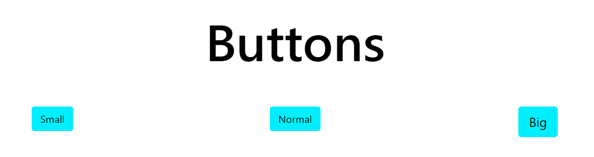
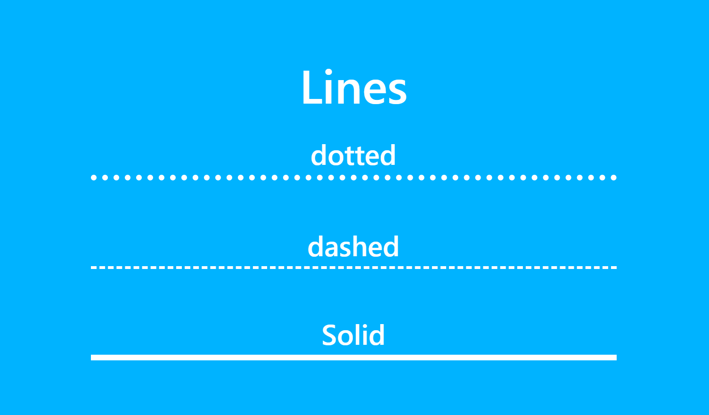

# Blocks
## Button

``wagtail_block_collection.blocks import BasicButtonBlock``
### Options
**Page & Url:**  
You can set on of these to point your button to something  
**Text:**  
The text on the button   
**Background color:**  
The color of the background of the button  
**Text color:**  
The color of the text inside the button  
**Size:**  
These are the default Bootstrap size options  
**Google font:**  
Choose a font from google fonts  

## Text
``wagtail_block_collection.blocks import TextBlock``
### Options
**Text align**  
Choose how to align the text if not it is inherited if you use the included section that wil be 'center'  
**Text color**  
You can override the text color inherited form the section  
**Google font**  
Choose a font from google fonts
**Text**  
The rich text that wil be displayed on the page.  

## Basic image
``wagtail_block_collection.blocks import ImageBlock``  

## Row
``wagtail_block_collection.blocks import Row``  
This is the bootstrap grid system

## Embed code
``wagtail_block_collection.blocks import EmbedBlock``  
This block can be used to include html code like custom iframes

## Title
``wagtail_block_collection.blocks import BasicTitleBlock``  

## Youtube Video
``wagtail_block_collection.blocks import YoutubeVideoBlock``  

## Card deck
``wagtail_block_collection.blocks import BasicCardDeck``  

## Collapse with button
``wagtail_block_collection.blocks import CollapseBlockButton``  

## Line
``wagtail_block_collection.blocks import Line``  

### Options
#### Width
The css unit on how wide the line needs to be.
#### Thicknes
The css unit how thick the line will be
### Style
**Doted:**  
**Dashed:**  
**Solid:**

## Google Maps
``wagtail_block_collection.blocks import GoogleMapsBlock``   
!!! note
    Before you can use this block you need to set the Google api key in the wagtail settings

## Typewriter
``wagtail_block_collection.blocks import TypeWriter``

## Image slider
``wagtail_block_collection.blocks import ImageSlider``

## Spacer
``wagtail_block_collection.blocks import Spacer``

## Icon
``wagtail_block_collection.blocks import IconBlock``

## Countdown
``wagtail_block_collection.blocks import CountdownBlock``
### Options
#### to_datetime
The date time you want to countdown to
#### day_string
This is the text that you want to after the day(s) left if you leave is empty the value will not be shown.
#### hour_string
This is the text that you want to after the hour(s) left if you leave is empty the value will not be shown.
#### minute_string
This is the text that you want to after the minute(s) left if you leave this empty the value will not be shown.
#### second_string
This is the text that you want to after the days left if you leave this empty the value will not be shown.
heading_type
heading_size
google_font

## Accordion
``wagtail_block_collection.blocks import Accordion``

## Text and image
``wagtail_block_collection.blocks import TextAndImageBlock``

## Alert
``wagtail_block_collection.blocks import AlertBlock``