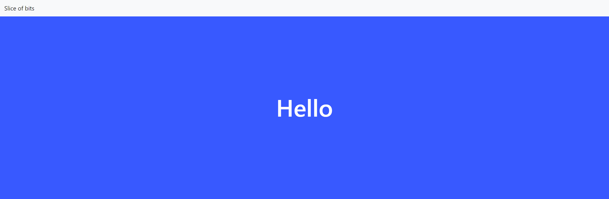
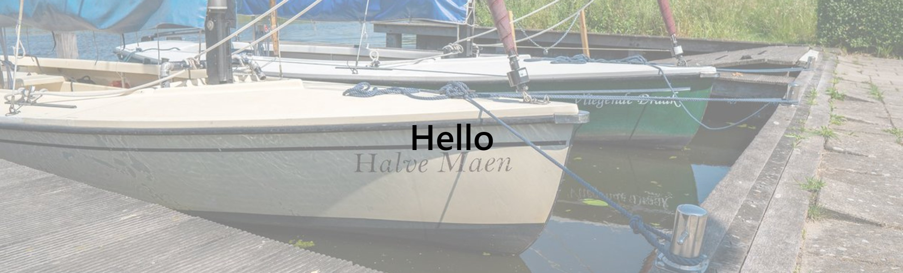

# Sections
## Empty sections
These sections can be used to place content inside
## settings
**Text color:** the Color of the text inside this section  
**Full width:** this makes this section full width instead of ``.container-fluid``  
**Bottom effect:** these are effects to style the bottom of the section  

### Section color background

This section is the most basic one there is. It is just a simple colored background.
#### Options
[See settings](#settings) for the general settings
**Background color:** This is the background color of the section

### Section color gradient background

This section uses css gradients as the background
#### Options
[See settings](#settings) for the general settings
##### stops
Stops are the diverent colors in the gradient.
You can use a tool like [cssgradient.io](https://cssgradient.io/) to easy visualize the gradient.  
**Color:** Is the color of the step  
**Stop:** this is the place where in the gradient this color is this is between 1 and 100  

### Image background section

This section has a background
#### Options
[See settings](#settings) for the general settings

### Image paralax background section

This section includes a image background that has a parallax scroll effect
#### Options
[See settings](#settings) for the general settings

## Section effects

## Premade sections
### Slider